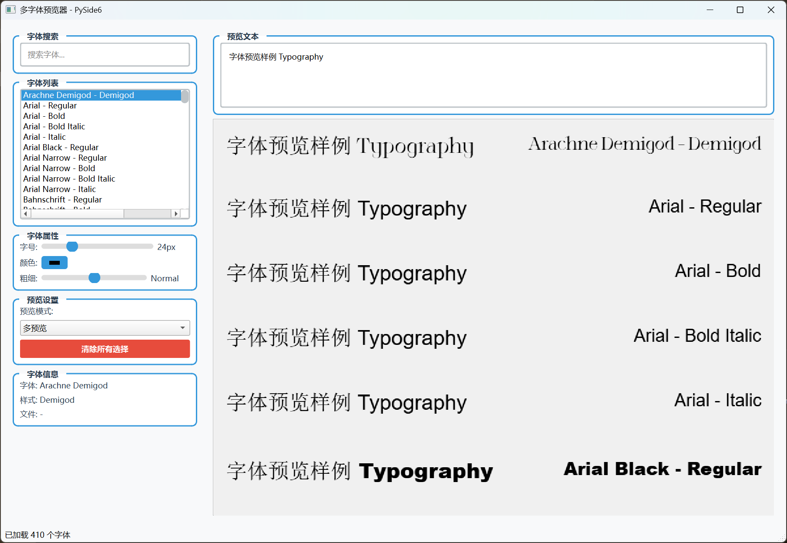

[🇨🇳 中文](README.md) | [🇺🇸 English](README_en.md)

---

# 多字体预览器 - PySide6 GUI应用程序

[](https://www.python.org/)
[](https://pypi.org/project/PySide6/)


一个功能强大的多字体预览GUI应用程序，使用PySide6构建，支持系统字体浏览、搜索、实时预览和多种预览模式切换。

## ✨ 功能特性

### 🎯 核心功能
- **系统字体列举**: 自动检测并加载系统所有安装字体及样式变体
- **字体搜索过滤**: 支持实时搜索和过滤字体，按名称快速定位
- **多重预览模式**: 提供单预览、多预览和选中字体多预览三种模式
- **实时效果调**: 动态调整字号、字体颜色和粗细，支持实时预览
- **字体信息展示**: 显示字体家族、样式、文件位置等详细信息
- **性能优化**: 异步字体加载、预览缓存、多线程处理，确保流畅体验

### 🔧 界面特性
- **现代UI设计**: 使用Fusion样式，配色美观，用户体验友好
- **响应式布局**: 自适应窗口大小，支持大尺寸显示
- **交互友好**: 支持字体多选、快捷操作、视觉反馈丰富
- **实时更新**: 参数调整立即反映到预览效果，无需重启

## 📋 系统要求

- **Python**: 3.11 或更高版本
- **操作系统**: Windows 10+, macOS 10.14+, Linux
- **依赖包**: PySide6
- **存储空间**: 至少 50MB 可用空间

## 🚀 快速开始

### 1. 克隆项目
```bash
git clone https://github.com/gasdyueer/fonts_previwer_GUI.git
cd fonts_previwer_GUI
```

### 2. 创建虚拟环境（推荐）
```bash
# Windows
python -m venv venv
venv\Scripts\activate

# Linux/macOS
python -m venv venv
source venv/bin/activate
```

### 3. 安装依赖
```bash
pip install -e .
```

### 4. 运行应用程序
```bash
python main.py
```

## 📖 使用指南

### 🖥️ 界面布局
应用程序使用三列布局设计：

1. **左侧控制面板**: 字体搜索、字体列表、属性控制、预览设置
2. **中间预览区域**: 字体效果实时预览
3. **右侧信息面板**: 字体详细信息展示

### 📝 操作步骤

#### 字体预览
1. 启动应用后，系统将自动加载所有字体（首次运行可能稍慢）
2. 在左侧字体列表中选择想要预览的字体
3. 支持单选或多选（按住Ctrl键进行多选）

#### 三种预览模式

**单预览模式（默认）**
- 只显示当前选中字体的预览效果
- 适合专注查看单个字体的细节

**多预览模式**
- 显示选中字体以及其相邻字体的预览
- 便于字体比较和选择

**选中字体模式**
- 显示所有选中字体的预览效果
- 最大显示前20个选中字体
- 适合批量预览多个选定字体

#### 属性调节
- **字号调节**: 使用滑块调节字体大小（8-72px）
- **颜色选择**: 点击颜色按钮打开调色板
- **粗细调整**: 使用滑块调节字体粗细（Thin到Black）

#### 预览文本
- 在顶部预览文本框中输入自定义文本
- 支持中文、英文、数字等各种字符
- 实时反映到所有预览效果中

## 🔧 开发说明

### 项目结构
```
fonts_previwer_GUI/
├── main.py          # 主应用程序文件
├── pyproject.toml   # 项目配置和依赖
├── .python-version  # Python版本要求
├── .gitignore       # Git忽略文件
└── README.md        # 项目文档
```

### 核心类说明

#### 1. FontLoader (异步字体加载器)
```python
class FontLoader(QThread)
```
- 异步线程加载系统字体
- 实时更新加载进度
- 过滤重复字体样式，优化内存使用

#### 2. FontPreviewWidget (字体预览组件)
```python
class FontPreviewWidget(QFrame)
```
- 自定义组件实现字体预览
- 支持文本自动换行
- 预览效果缓存优化性能

#### 3. MainWindow (主窗口)
```python
class MainWindow(QMainWindow)
```
- GUI主窗口和界面管理
- 处理用户操作和事件
- 协调各个组件间的交互

### 性能优化特性

1. **异步加载**: 字体加载使用专用线程，避免界面冻结
2. **缓存机制**: 预览效果缓存，减少重复绘制开销
3. **延迟更新**: 使用QTimer实现防抖，避免频繁刷新
4. **内存优化**: 字体样式过滤，去除冗余变体
5. **线程安全**: UI线程与加载线程分离，提高响应性

## 🎨 自定义样式

应用程序使用Qt样式表进行外观定制：
- 现代蓝色主题配色
- 圆角按钮和边框
- 悬停状态动画效果
- 高对比度视觉设计

## 🐛 故障排除

### 常见问题解决

**1. 字体加载缓慢**
- 这是正常现象，很多字体系统的首次加载需要时间
- 后续启动会使用缓存，速度会明显提升

**2. 某些字体不显示**
- 部分特殊字体（如图标字体）可能不显示预览
- 这是由于它们不包含标准字符集导致

**3. 界面显示异常**
- 确保系统已安装中文字体
- 检查显卡驱动是否支持OpenGL加速

**4. 无法启动应用程序**
- 检查Python版本是否为3.11+
- 确保PySide6已正确安装
- 运行命令检查：`python -c "import PySide6; print('PySide6 OK')"`

## 📄 许可证

本项目暂时未指定开源许可证。如需商业使用请联系开发者。

## 🤝 贡献指南

欢迎提交Issue和Pull Request来改进项目！

### 开发环境设置
```bash
# 安装开发依赖
pip install black flake8 pytest

# 运行代码格式化
black main.py

# 运行代码检查
flake8 main.py
```

## 📞 联系我们

如有问题或建议，请通过以下方式联系：
- 提交GitHub Issue
- 发送邮件至开发者邮箱

---

**项目版本**: v1.0.0 | **最后更新**: 2024年